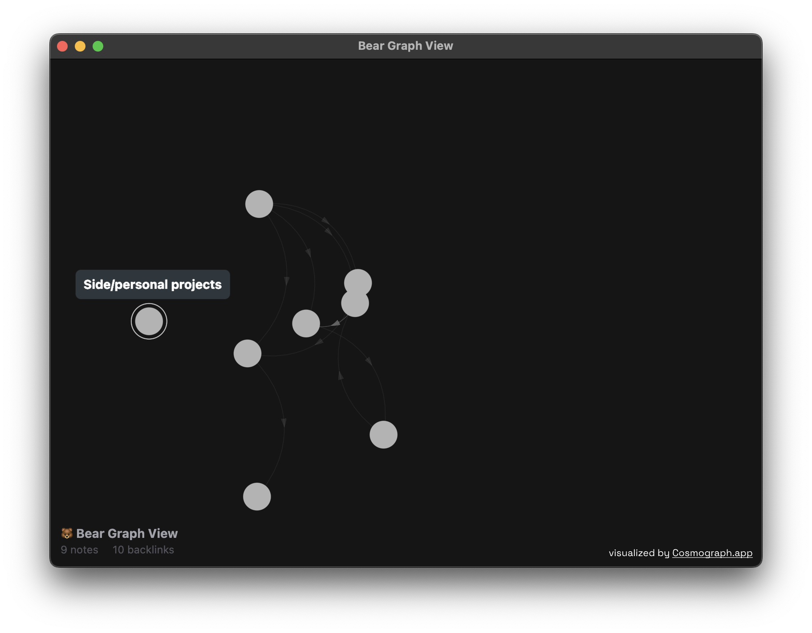
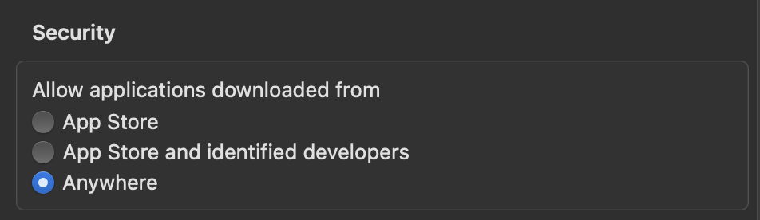

## Install

On the right-hand side of the github page, you'll find the "Releases" section. Here, you can find a link to the v1.0.0 release. Alternatively, [click here to download dmg directly](https://github.com/Chuckleroot/bear-graph/releases/download/v1.0.0/Bear.Graph-1.0.0-arm64.dmg) (just open the dmg and move application file to your applications folder, then just run the app from there like any other app on your macOS)

Seems distributing non-signed apps is not as easy as I thought. Unfortunately, it will require some more steps to use the app.

Open the command line/terminal. Type in `sudo spctl --master-disable` \- it will ask you to fill in your password. Then, head to the System Settings -> Privacy & Security -> Allow applications downloaded from - here a new option should appear. Check "Anywhere"

If you don't feel safe with this option turned on, simply type in terminal `sudo spctl --master-enable` \- it will go back to normal.

This behaviour is not due to app being unsafe for your system, but the fact of how signing works on macOS. Developers need to pay around $99/yr for a membership to sign their apps. I, however, can't afford it for just one non-profit project. Hope you understand!

## Usage

`⌘ + R` to refresh the graph

`LMB` on a node to open its control panel, through which you can either open it in Bear or trash it.

`RMB` anywhere to repulse nodes from your mouse

## Acknowledgements

Thanks to [Cosmograph](https://github.com/cosmograph-org) for their awesome graphing library, and assistance with its React beta release.
